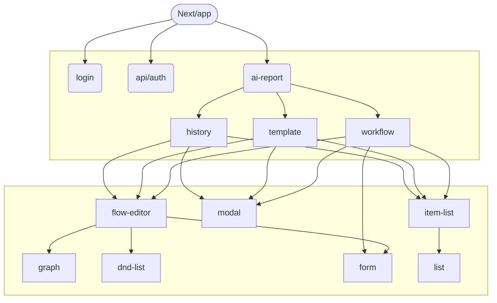

## 關鍵技術
* TypeScript 
* React.js - frontend lib 
* Next.js - SSR framework
* React Flow - interactive diagrams lib
* Auth.js - authentication lib for web
* PrimeReact - PrimeUI for React.js
* tailwindcss - utility-first CSS framework

***

## 安裝&啟動專案
* 環境需求 **Node.js 18.17** 以上。
* ***第一次執行*** 專案請先執行請先執行下面兩點動作
    * 請先執行`npm install`以安裝專案所需要的module以及各項函式庫。
    * 請在專案資料夾中新增 **.env.local** 檔，並將下面的內容新增至 *.env.local* 中。
       > NEXTAUTH_URL=http://localhost:3000 \
       > NEXTAUTH_SECRET=d2129283e8b788da35f3f7e7486daab1 \
       > KEYCLOAK_CLIENT_ID=ai_report_fe \
       > KEYCLOAK_CLIENT_SECRET=6eDPdttnbw2YzDy2TofYyAqjwVdUGrvk 
       >
       > ***!!注意: 請不要將 .env.local 上傳至 github 中***
* 執行`npm run dev`後即可啟動專案。

***

## 建置&部屬專案
* 請先ssh至伺服器: *192.168.1.196* 。
* 開啟資料夾至 */home/ccoe/Projects/AI_RPT_FE/* 。
* 執行 `git pull` 以更新伺服器上的程式，*passphrase for key* 為 **ccoe0208**。
    * 目前196上的git branch為**development**，所以更新前請先確保要deploy的功能已經merge至**development**。
    * 目前196上是透過**Deploy key**取得git repo上的程式。Deploy key的存取權限為**唯讀**。
    * **!!注意:** 強烈建議請不要直接修改伺服器上的code，這會造成未來deploy上的衝突。
* 執行 `npm run build:196` 以建置專案。
* 執行 `pm2 restart ecosystem.config.js` 重啟網站。

***

## 元件關係

***
## 程式結構與功能說明
```
next-app/
├── src/
│   ├── api-helpers   - 所有需要透過Axios呼叫API的function都實作在這邊
│   ├── app           - 遵循next.js框架規則所產生的資料夾
│   ├── components    - 所有畫面上的原件都放在此資料架內/
│   │   ├── graph       - #1.1
│   │   ├── flow-editor - #1.2
│   │   ├── list        - #2.1
│   │   ├── item-list   - #2.2
│   │   ├── dnd-list    - #3
│   │   └── form        - #4
│   ├── interface     - 所有資料的interface都放在此資料夾內
│   ├── layout        - 所有畫面上的layout都放在此資料架內/
│   │   ├── standard-layout  - 目前畫面主要的排版
│   │   └── global-fn-layout - 所有global功能(e.g. showMessage)都集中在這邊
│   ├── lib           - 所有共用函式都放在此資料架內
│   ├── settings      - 所有與整個app相關的設定放在此資料架內
│   ├── style         - 所有共用的css都放在此資料架內
│   └── middleware.ts - 此專案中，目前主要用來注入authentication service
├── .env 
├── .env.196            - 此檔的設定會在執行"npm run build:196"時被使用
├── ecosystem.config.js - pm2的配置檔，讓pm2起動此專案
├── postcss.config.js   - 此專案中用來擴充tailwind.css的plugin
└── tailwind.config.ts  - tailwind.css的設定檔
```
#### 1.1. graph
> * 基於react-flow實作的流程圖元件。
> * 目前在此專案中graph僅用於實作 *1.2.flow-editor* 。 
> * *reference: https://reactflow.dev/api-reference*

**graph 功能說明**
| 功能 | 說明 |
| :-- | :-- |
| initialNodes | 初始節點 |
| initialEdges | 初始Edge |
| readonly | 是否為唯讀模式；如果為唯讀模式，則無法編輯畫面上的任何元素。 |
| hideMiniMap | 是否隱藏小地圖 |
| hideCtrls | 是否隱藏控制面板 |
| graphRef | 用於獲取instance，並且直接透過instance操作graph；重點功能請參考下方**graphRef 功能說明**。 |
| edgeEditable | edge是否可編輯 |
| normalizeNode | 正規化節點；當節點數據格式與節點展示格式不一致時，可以透過此方法進行正規化。 |
| normalizeEdge | 正規化Edge；當Edge數據格式與Edge展示格式不一致時，可以透過此方法進行正規化。 |
| onNodesSelected | *略* |
| onEdgesSelected | *略* |
| onNodesChange | *略* |
| onEdgesChange |*略* |

**graphRef 功能說明**
| 功能 | 說明 |
| :-- | :-- |
| addNode | 新增節點。 |
| setNode | 設定(更新)現有節點資訊。 |
| setNodes | 設定(更新)多個節點，可以透過此方法進行批量設定。 |
| getNodes | 取得所有節點 |
| removeNode | 刪除節點 |
| duplicateNode | 複製節點 |
| addEdge | 新增Edge |
| setEdge | 設定(更新)現有Edge資訊。 |
| setEdges | 設定(更新)多個Edge，可以透過此方法進行批量設定 |
| removeEdge | 刪除Edge |
| resetAllElements | 重新設定所有element，包括所有節點以及edge。 |
| reactFlowInstance | 取得react-flow Instance，並且直接使用其功能。詳細文件請參考*https://reactflow.dev/api-reference* |

#### 1.2. flow-editor
> * 基於graph實作，並且用於編輯流程相關資料 *(e.g. workflow, template)* 的元件。

**功能說明**
| 功能 | 說明 |
| :-- | :-- |
| flows | 流程節點資料 |
| inEdit | 是否為編輯模式 |
| flowNameMapper | flow id對應名稱，用於顯示在flow節點上 |
| delayRender | 延遲渲染時間，用於解決渲染時的閃爍問題 |
| actionBarContent | 渲染flow-edtior上方的actionBar |
| actionBarClass | flow-edtior上方的actionBar的className |
| loading | *略* |

#### 2.1. list
> * 以**react-virtualized**實作的。
> * react-virtualized可以用於*lazy-loading*的實作，以及優化畫面效能；相當值得花時間學習。
> * *reference: https://bvaughn.github.io/react-virtualized/#/components/List*

**功能說明**
| 功能 | 說明 |
| :-- | :-- |
| data | 泛型型別，list資料。 |
| renderItem | 渲染List的item，讓使用者由外部導入的資料型態進行渲染。 |
| className | *略* |
| style | *略* |
| onItemClick | *略* |

#### 2.2. item-list
> * 以list實作的公版元件。

**功能說明**
| 功能 | 說明 |
| :-- | :-- |
| items | 泛型型別，list items資料。 |
| selectedItem | 被選擇的item |
| idPath | item的id欄位，預設為id |
| title | 渲染item的title |
| subTitle | 渲染item的subTitle |
| topBarContent | 渲染list上方的橫條內容 |
| topBarClassName | list上方橫條的className |
| onItemSelected | 點擊item時的callback |
| renderMenus | 渲染item的選單, 例如: 編輯、刪除 |

#### 3. dnd-list
> * 以**react-beautiful-dnd**實作。
> * 前僅用於實作flow-editor上方可以拖曳其中各個項目的action bar。
> * *reference: https://www.npmjs.com/package/react-beautiful-dnd#documentation-*

**功能說明**
| 功能 | 說明 |
| :-- | :-- |
| items | 泛型型別，list items資料。 |
| droppableId | droppable 區域的id，基於react-beautiful-dnd的官方文件而新增此屬性 |
| isDragDisabled | 是否關閉拖曳功能 |
| itemStyle | list item style |
| idPath | 注入的資料中，用來當作id的path；例如: id, flow.id。預設為id |
| disableWholeDraghandle | 關閉整個拖曳的handle，通常會用於item僅能通過drag handle來拖曳的情況。 |
| disableChangeOrder | 是否關閉拖曳排序功能 |
| renderItem | 渲染List的item，讓使用者由外部導入的資料型態進行渲染。 |
| onItemClick | *略* |
| onItemMouseDown | *略* |
| onDragEnd | 當list item結束拖曳時的callback，通常可以用來作為更新畫面用。 |
| direction | list 方向，設定**水平**方向或**垂直**方向；預設為*垂直*。 |
| onChange | *略* |

#### 4. form
> * 以react-hook-form實作
> * *reference: https://react-hook-form.com/*

**form 功能說明**
| 功能 | 說明 |
| :-- | :-- |
| form | form instance，可以用於外部控制form |
| defaultValues | 預設值 |
| children | From的子元件，被呼叫時會將FormItem以及FormList傳入子元件，讓子元件將其渲染。 |
| onLoad | *略* |
| onDestroyed |  *略*  |
| className |  *略*  |
| onSubmit |  *略*  |
| readonly |  *略*  |

**formItem 功能說明**
| 功能 | 說明 |
| :-- | :-- |
| name | form field的名稱，這邊是以path name的方式來設定。 |
| className | *略* |
| children | *略* |
| label | *略* |
| rules | form item的驗證規則 |
| valuePropName | form item 的component的value prop name，預設為**value**。 |
| disableFlowLabel | 是否隱藏label |
| disabled | *略* |
| defaultValue | form field的預設值 |

**form instance 功能說明**
| 功能 | 說明 |
| :-- | :-- |
| getValues | 取得form的值 |
| setValue | 設定form的值 |
| formCore | form core instance (react-hook-form) |
| submit | 提交form |

***